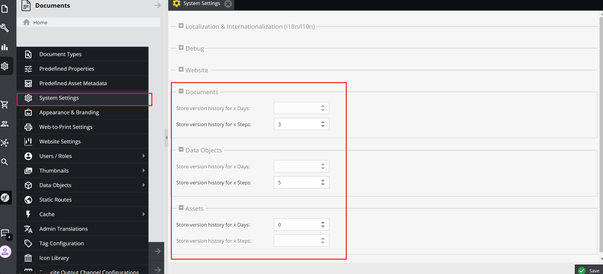

Version
<!-- [TOC] -->

# Config version steps with System Settings

1. Config steps



2. Enable service

```bash
starfruit_maintenance:
    cleanup_services:
        version:
            enable: true
```
